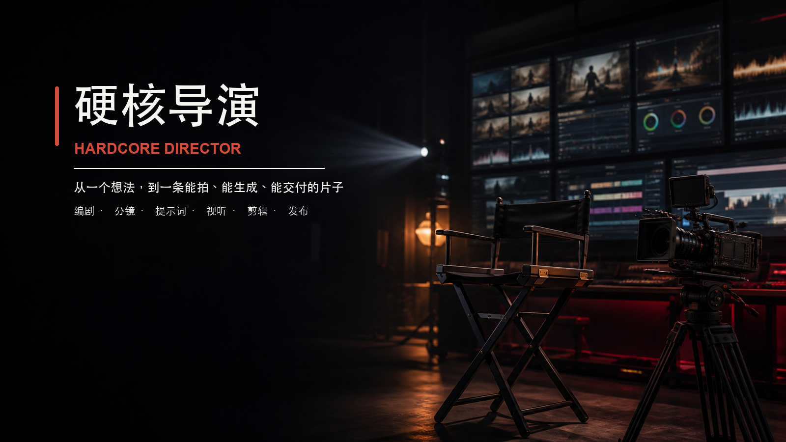

<p align="center">
  
</p>

<p align="center">
  
  
  
</p>

<h1 align="center">硬核导演 · Hardcore Director</h1>

<p align="center">
  面向 Codex / Agent 工作流的影视与 AI 视频创作总控 Skill。<br />
  从故事、人物与分镜，到生成提示词、声音、剪辑与发布，统一成一条可执行的制作链路。
</p>

---

## 它不是“提示词大全”

`hardcore-director` 先判断你正处于哪个制作阶段，再读取当前真正需要的方法模块。

它解决的不是“再写一段更华丽的描述”，而是三个更具体的问题：

- **故事能不能成立**：人物有欲望，场景有阻力，转折由行动产生。
- **画面能不能执行**：主体、站位、动作方向、机位、光线、声音都能落到镜头。
- **成片能不能交付**：时长、连续性、平台格式、字幕、响度与发布表达都有复核门禁。

> 先解决叙事与可执行性，再叠加风格。

## 能力版图

| 制作阶段 | 可以交付什么 |
| --- | --- |
| 故事开发 | 高概念、梗概、人物弧光、世界观、长短片与多集结构 |
| 编剧与短剧 | 完整剧本、竖屏短剧、冲突升级、钩子、反转与爽点 |
| 角色与场景 | 角色 DNA、造型锚点、场景板、Blocking、空间与连续性 |
| 导演与分镜 | 景别、机位、构图、运镜、表演、微表情、镜头时长与声音 |
| AI 视频 | Seedance / 即梦 / Vidu / 可灵 / 海螺等平台的可执行提示词 |
| 视听风格 | 导演美学、色彩、调色、节奏、环境音、Foley 与 AI 配乐 |
| 分析与后期 | 拉片、竞品反推、实拍素材剪辑、字幕、混音与导出规格 |
| 内容发布 | 短视频脚本、黄金三秒、标题、封面建议与平台友好改写 |

## 工作方式

```text
你的想法 / 素材 / 剧本
        ↓
识别制作阶段与硬约束
        ↓
按需路由 2–5 个方法模块
        ↓
故事与视觉可执行性判断
        ↓
分镜 / 提示词 / 剪辑任务单
        ↓
连续性、时长、声音与平台复核
        ↓
可直接进入制作的交付物
```

它不会在一次回答里机械加载全部参考，而是按任务裁剪：编剧任务先处理戏剧动作，分镜任务再处理空间与连续性，平台生成任务最后转换成对应语法。

## 快速安装

```bash
git clone https://github.com/jlam00-dev/hardcore-director.git ~/.codex/skills/hardcore-director
```

重新打开 Codex 会话后，可直接点名调用：

```text
使用 $hardcore-director，把这个故事改成 90 秒竖屏短剧。
```

```text
使用 $hardcore-director，把这份剧本拆成可拍摄的分镜表。
```

```text
使用 $hardcore-director，把这组参考图变成角色稳定、动作连续的 AI 视频提示词。
```

```text
使用 $hardcore-director，拉片分析这个广告，并给出可复用的镜头、色彩和声音策略。
```

## 标准制作链路

1. **定义目标** — 观众、载体、时长、画幅和期望情绪。
2. **建立故事** — 人物欲望、阻力、转折、结局或 CTA。
3. **建立视觉圣经** — 角色、场景、色彩、材质、光线与一致性锚点。
4. **设计镜头** — 景别、机位、站位、动作方向、运镜、时长与声音。
5. **平台落地** — 转成生成提示词、拍摄单或剪辑任务单。
6. **质量复核** — 连续性、总时长、状态变化、声音同步与平台格式。
7. **交付成品** — 只输出当前阶段真正需要使用的版本。

## 质量门禁

- 每场戏必须有目标、阻力和变化；对白不能替代戏剧动作。
- 抽象情绪必须转成眼神、呼吸、肌肉张力与身体动作。
- 多人物镜头必须写清站位、朝向、距离、受力与落点。
- 服装、妆发、伤痕、道具与光线方向必须保持前后连续。
- 镜头时长之和必须等于总时长，平台字段与画幅必须正确。
- 分析结论必须有时间码或镜头编号支撑，并区分观察与推断。

## Seedance 2.5 / 即梦 2.5

涉及时间戳、30–180 秒长视频、视频延长、局部编辑、多人参考、绿幕、无缝转场、多宫格分镜等 2.5 专用能力时，本 Skill 会把故事、表演与分镜判断交给独立的专业路由：

- [`hc-sd2-5-prompt-writer`](https://github.com/jlam00-dev/hc-sd2-5-prompt-writer)

两个 Skill 的职责不同：`hardcore-director` 负责创作与制作统筹，`hc-sd2-5-prompt-writer` 负责 Seedance 2.5 的平台语法和功能边界。

## 目录结构

```text
hardcore-director/
├── README.md
├── SKILL.md                  # 主入口、任务路由与质量门禁
├── agents/
│   └── openai.yaml           # Skill 展示信息
├── assets/
│   └── hardcore-director-hero.png
└── references/               # 编剧、导演、分镜、视听与发布方法库
    └── *.md
```

## 设计原则

- 叙事先于风格，行动先于解释。
- 平台规则优先于通用模板。
- 生成内容与后期操作分开描述。
- 风格、色彩、节奏与声音必须服务内容。
- 不把内部草稿当成交付物。

---

<p align="center">
  <strong>从一个想法，到一条能拍、能生成、能交付的片子。</strong>
</p>
